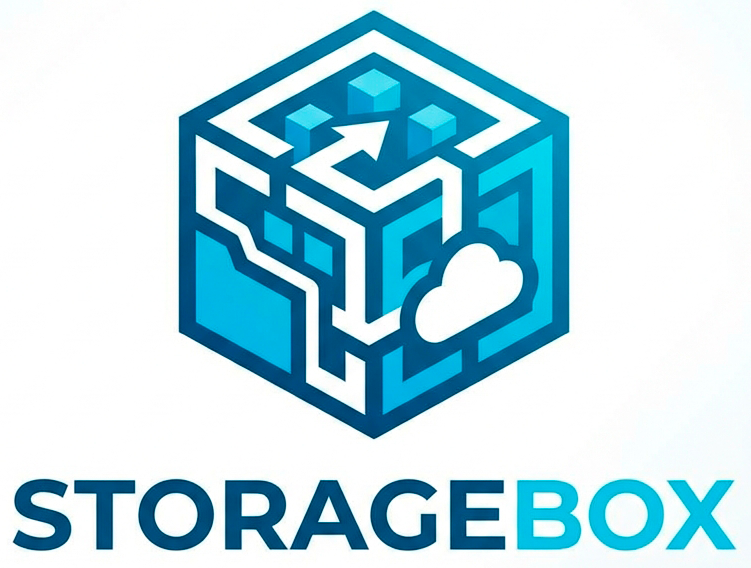

# StorageBox

> **Асинхронный сервис управления файловым хранилищем** на FastAPI с автоматической очисткой просроченных файлов, квотированием и хешированием.

---
[](https://pypi.org/project/fastapi/)
[](https://python.org)


## 📋 Содержание

- [Описание](#-описание)
- [Возможности](#-возможности)
- [Стек технологий](#-стек-технологий)
- [Архитектура проекта](#-архитектура-проекта)
- [Быстрый старт](#-быстрый-старт)
  - [Docker Compose (рекомендуется)](#docker-compose-рекомендуется)
  - [Локальная разработка](#локальная-разработка)
- [Конфигурация](#-конфигурация)
  - [Переменные окружения](#переменные-окружения)
  - [Лимиты размеров файлов](#лимиты-размеров-файлов)
- [API документация](#-api-документация)
  - [Файлы](#файлы-files)
  - [Пользователи](#пользователи-users)
- [База данных](#-база-данных)
  - [Модели](#модели)
  - [Миграции](#миграции)
- [Структура хранилища](#-структура-хранилища)
- [Планировщик задач](#-планировщик-задач)
- [Логирование](#-логирование)
- [Лицензия](#-лицензия)

---

## 📖 Описание

**StorageBox** — это REST API сервис для управления персональным файловым хранилищем. Сервис позволяет загружать, скачивать и управлять файлами с автоматическим контролем квот, категоризацией по типам, хешированием (MD5 + SHA256) и возможностью установки срока годности файлов.

### Ключевые особенности

- 🚀 **Полностью асинхронный** — FastAPI + asyncpg + SQLAlchemy 2.0
- 🗄️ **Автоматические миграции** — Alembic применяется при старте
- ⏰ **Срок годности файлов** — файлы с `expires_at` удаляются автоматически
- 📊 **Квотирование** — лимит хранилища на пользователя (по умолчанию 1 GB)
- 🔒 **Хеширование** — MD5 + SHA256 для каждого загруженного файла
- 📁 **Автокатегоризация** — определение категории по расширению файла
- 🔄 **Фоновая очистка** — APSScheduler удаляет просроченные файлы каждый час

---

## ✨ Возможности

| Функция | Описание |
|---|---|
| **Загрузка файлов** | Multipart upload с валидацией расширения, размера и автокатегоризацией |
| **Скачивание файлов** | Прямая отдача через `FileResponse` |
| **Метаданные файлов** | Имя, размер, категория, расширение, хеши, временные метки |
| **Удаление файлов** | Атомарное удаление с диска и из БД с пересчётом квоты |
| **Управление пользователями** | Авто-создание при первой загрузке, получение списка файлов, удаление |
| **Срок годности** | Optional `expires_at` при загрузке — файл удалится автоматически |
| **Квоты хранилища** | Лимит на пользователя с контролем при загрузке |
| **Уникализация имён** | Обработка коллизий с помощью суффикса-итератора (`file_1`, `file_2`, ...) |
| **Цветное логирование** | Консольные логи с подсветкой + файл-логгер с ротацией по дням |

---

## 🛠 Стек технологий

| Категория | Технологии |
|---|---|
| **Веб-фреймворк** | [FastAPI](https://fastapi.tiangolo.com/) >= 0.135.2 |
| **ASGI-сервер** | [Uvicorn](https://www.uvicorn.org/) >= 0.42.0 |
| **Валидация данных** | [Pydantic](https://docs.pydantic.dev/) >= 2.12.5 |
| **ORM** | [SQLAlchemy 2.0](https://docs.sqlalchemy.org/) >= 2.0.48 (async) |
| **Миграции** | [Alembic](https://alembic.sqlalchemy.org/) >= 1.18.4 |
| **База данных** | [PostgreSQL 16](https://www.postgresql.org/) (Alpine) |
| **Драйвер БД** | [asyncpg](https://magicstack.github.io/asyncpg/) >= 0.31.0 |
| **Планировщик** | [APScheduler](https://apscheduler.readthedocs.io/) >= 3.11.2 |
| **Контейнеризация** | [Docker](https://www.docker.com/) + [Docker Compose](https://docs.docker.com/compose/) |
| **Управление зависимостями** | [Poetry](https://python-poetry.org/) |
| **Логирование** | [colorlog](https://pypi.org/project/colorlog/) >= 6.10.1 |

---

## 🏗 Архитектура проекта

Проект следует **трёхуровневой архитектуре**:

```
StorageBox/
├── src/
│   ├── app/                      # Presentation Layer (FastAPI)
│   │   ├── main.py               # Точка входа, lifespan, инициализация
│   │   ├── api/                  # REST-роутеры
│   │   │   ├── files.py          # /files — upload, download, get, delete
│   │   │   └── users.py          # /users — файлы пользователя, удаление
│   │   └── schemas/              # Pydantic-схемы запросов/ответов
│   │
│   ├── core/                     # Business Logic Layer
│   │   ├── settings.py           # Pydantic Settings (env-конфигурация)
│   │   ├── logging_settings.py   # Singleton-логгер с цветным выводом
│   │   ├── storage.py            # Инициализация директорий хранилища
│   │   └── scheduler.py          # APScheduler (очистка просроченных файлов)
│   │
│   └── database/                 # Data Access Layer
│       ├── database.py           # AsyncEngine, sessionmaker, миграции
│       ├── models.py             # SQLAlchemy-модели User, File
│       ├── crud.py               # UserCRUD, FileCRUD (async)
│       └── dependencies.py       # FastAPI-зависимости (DI)
│
├── alembic/                      # Миграции БД
├── storage/                      # Файловое хранилище (монтируется в Docker)
├── logs/                         # Логи приложения (ротация по дням)
├── docker-compose.yml            # Сервисы: app + postgres
├── Dockerfile                    # Образ приложения
└── pyproject.toml                # Poetry-зависимости
```

---

## 🚀 Быстрый старт

### Docker Compose (рекомендуется)

```bash
# 1. Клонируйте репозиторий
git clone <repository-url>
cd StorageBox

# 2. (Опционально) Создайте .env файл
cat > .env << EOF
POSTGRES_PASSWORD=your_secure_password
POSTGRES_USER=postgres
POSTGRES_DB=StorageBox
UVICORN_PORT=8001
EOF

# 3. Запустите сервисы
docker-compose up -d

# 4. Откройте Swagger UI
# http://localhost:8000/docs
```

Сервисы Docker Compose:
- **`app`** — FastAPI приложение (порт 8000 → 8001)
- **`postgres`** — PostgreSQL 16 Alpine (порт 5432, healthcheck)

### Локальная разработка

```bash
# 1. Установите зависимости
pip install -r requirements.txt
# или через Poetry
poetry install

# 2. Создайте .env файл с нужными настройками (см. Конфигурация)

# 3. Запустите сервер
uvicorn src.app.main:app --host 0.0.0.0 --port 8001 --reload

# 4. Swagger UI доступен по адресу:
# http://localhost:8001/docs
```

---

## ⚙️ Конфигурация

Все настройки задаются через переменные окружения. Значения по умолчанию указаны в [`src/core/settings.py`](src/core/settings.py).

### Переменные окружения

#### База данных PostgreSQL

| Переменная | По умолчанию | Описание |
|---|---|---|
| `POSTGRES_HOST` | `localhost` | Хост PostgreSQL |
| `POSTGRES_PORT` | `5432` | Порт PostgreSQL |
| `POSTGRES_DB` | `StorageBox` | Имя базы данных |
| `POSTGRES_USER` | `postgres` | Пользователь БД |
| `POSTGRES_PASSWORD` | `admin` | Пароль БД |

#### Connection Pool

| Переменная | По умолчанию | Описание |
|---|---|---|
| `DB_POOL_SIZE` | `10` | Размер пула соединений |
| `DB_MAX_OVERFLOW` | `20` | Максимальный overflow пула |
| `DB_POOL_RECYCLE` | `3600` | Переподключение через (секунды) |
| `DB_POOL_TIMEOUT` | `30` | Таймаут ожидания соединения (секунды) |
| `DB_COMMAND_TIMEOUT` | `60` | Таймаут команды (секунды) |
| `DB_STATEMENT_TIMEOUT` | `30000` | Таймаут запроса (миллисекунды) |
| `DB_LOCK_TIMEOUT` | `10000` | Таймаут блокировки (миллисекунды) |
| `DB_ECHO` | `False` | Логирование SQL-запросов |
| `DB_APPLICATION_NAME` | `storagebox` | Имя приложения в БД |

#### Uvicorn

| Переменная | По умолчанию | Описание |
|---|---|---|
| `UVICORN_PORT` | `8001` | Порт сервера |
| `UVICORN_HOST` | `0.0.0.0` | Хост сервера |
| `UVICORN_RELOAD` | `False` | Автоперезагрузка при изменении кода |

#### Хранилище файлов

| Переменная | По умолчанию | Описание |
|---|---|---|
| `STORAGE_TYPE` | `local` | Тип хранилища (пока только `local`) |
| `STORAGE_PATH` | `<project_root>/storage` | Путь к файловому хранилищу |
| `MAX_TOTAL_SIZE_FOR_USER_MB` | `1024` | Общий лимит хранилища на пользователя (MB) |

#### Логирование

| Переменная | По умолчанию | Описание |
|---|---|---|
| `LOGGER_LEVEL` | `INFO` | Уровень логирования |
| `NOISY_LOGGERS` | _пусто_ | Подавляемые логгеры (через запятую) |

### Лимиты размеров файлов

| Категория | Переменная | По умолчанию (MB) |
|---|---|---|
| Общий лимит | `MAX_FILE_SIZE_MB` | 250 |
| Документы | `MAX_DOCUMENT_SIZE_MB` | 250 |
| Архивы | `MAX_ARCHIVE_SIZE_MB` | 250 |
| Изображения | `MAX_IMAGE_SIZE_MB` | 250 |
| Видео | `MAX_VIDEO_SIZE_MB` | 250 |
| Аудио | `MAX_AUDIO_SIZE_MB` | 250 |

#### Разрешённые расширения по категориям

| Категория | Расширения |
|---|---|
| 📄 **documents** | `.pdf`, `.doc`, `.docx`, `.txt`, `.rtf`, `.odt`, `.xls`, `.xlsx`, `.ods`, `.csv`, `.ppt`, `.pptx`, `.odp`, `.log`, `.rf` |
| 📦 **archives** | `.zip`, `.rar`, `.7z`, `.tar`, `.gz`, `.bz2` |
| 🖼️ **images** | `.jpg`, `.jpeg`, `.png`, `.gif`, `.bmp`, `.svg`, `.webp`, `.ico`, `.tiff`, `.heic` |
| 🎬 **video** | `.mp4`, `.avi`, `.mkv`, `.mov`, `.wmv`, `.flv`, `.webm`, `.m4v` |
| 🎵 **audio** | `.mp3`, `.wav`, `.flac`, `.ogg`, `.m4a`, `.aac`, `.wma` |

---

## 📡 API документация

После запуска сервера интерактивная документация доступна по адресам:
- **Swagger UI**: `http://localhost:8001/docs`
- **ReDoc**: `http://localhost:8001/redoc`

### Файлы (`/files`)

#### Загрузка файла

```http
POST /files/upload
Content-Type: multipart/form-data

file: <binary>
user_id: UUID
expires_at: datetime (optional)
```

**Ответ**: `201 Created`
```json
{
  "file_id": "uuid",
  "filename": "example.jpg",
  "file_size": 47023,
  "file_category": "images",
  "file_extension": ".jpg",
  "created_at": "2026-04-09T15:48:23.322571+00:00",
  "expires_at": null,
  "owner_id": "uuid",
  "md5_hash": "abc123...",
  "sha256_hash": "def456..."
}
```

#### Скачивание файла

```http
GET /files/{file_id}/download
```

**Ответ**: `200 OK` — `FileResponse` с файлом

#### Информация о файле

```http
GET /files/{file_id}
```

**Ответ**: `200 OK` — метаданные файла (см. пример выше)

#### Удаление файла

```http
DELETE /files/{file_id}
```

**Ответ**: `200 OK`
```json
{ "message": "Файл успешно удалён" }
```

### Пользователи (`/users`)

#### Получить все файлы пользователя

```http
GET /users/{user_id}/files
```

**Ответ**: `200 OK`
```json
{
  "files": [
    {
      "file_id": "uuid",
      "filename": "example.jpg",
      "file_size": 47023,
      "file_category": "images",
      "file_extension": ".jpg",
      "created_at": "2026-04-09T15:48:23.322571+00:00",
      "expires_at": null,
      "owner_id": "uuid"
    }
  ],
  "total": 1
}
```

#### Удаление пользователя

```http
DELETE /users/{user_id}
```

**Ответ**: `200 OK`
```json
{ "message": "Пользователь успешно удалён" }
```

---

## 🗃️ База данных

### Модели

#### User (`users`)

| Поле | Тип | Описание |
|---|---|---|
| `id` | `UUID` (PK) | Уникальный идентификатор |
| `username` | `String(255)` | Имя пользователя (indexed) |
| `storage_used` | `BigInteger` | Использовано байт (default: 0) |
| `storage_limit` | `BigInteger` | Лимит хранилища (default: 1 GB) |
| `created_at` | `DateTime` | Дата создания (indexed) |
| `is_active` | `Boolean` | Статус активности |

**Связь**: one-to-many с `File`

#### File (`files`)

| Поле | Тип | Описание |
|---|---|---|
| `id` | `UUID` (PK) | Уникальный идентификатор |
| `owner_id` | `UUID` (FK → users.id) | Владелец файла |
| `filename` | `String(255)` | Оригинальное имя файла |
| `file_path` | `String(500)` | Путь к файлу на диске |
| `file_size` | `BigInteger` | Размер в байтах |
| `file_category` | `String(20)` | Категория (documents/archives/images/video/audio) |
| `file_extension` | `String(10)` | Расширение файла |
| `md5_hash` | `String(32)` | MD5-хеш (indexed) |
| `sha256_hash` | `String(64)` | SHA256-хеш |
| `created_at` | `DateTime` | Дата создания (indexed) |
| `updated_at` | `DateTime` | Дата обновления |
| `expires_at` | `DateTime` | Срок годности (nullable) |

**Связь**: many-to-one с `User`

```
User (1) ────────< File (N)
  └── files          └── owner
```

### Миграции

Миграции применяются **автоматически** при старте приложения. Для ручного управления:

```bash
# Создать новую миграцию
alembic revision --autogenerate -m "описание изменений"

# Применить все миграции
alembic upgrade head

# Откатить последнюю миграцию
alembic downgrade -1

# Проверить текущую ревизию
alembic current
```

#### История миграций

| Ревизия | Описание |
|---|---|
| `6f894e72e66a` | Initial: создание таблиц `users` (с email) и `files` |
| `aaecebf2256d` | Удаление колонки `email` из `users` |
| `b7a13f9efbfe` | Добавление колонки `expires_at` в `files` |

---

## 📁 Структура хранилища

Файлы хранятся на диске в структурированном виде:

```
storage/
└── user_<username>/
    ├── documents/
    │   └── <md5_prefix>_<filename>.<ext>
    ├── archives/
    │   └── ...
    ├── images/
    │   └── ...
    ├── video/
    │   └── ...
    └── audio/
        └── ...
```

Имена файлов сохраняются с префиксом первых 8 символов MD5-хеша для уникальности.

---

## ⏰ Планировщик задач

Сервис использует **APScheduler** для фоновой очистки просроченных файлов.

| Параметр | Значение |
|---|---|
| **Задача** | Удаление файлов с `expires_at < now()` |
| **Интервал** | Каждый 1 час |
| **Действия** | Удаление с диска → удаление из БД → декремент `storage_used` |

---

## 📝 Логирование

Логирование настроено через кастомный singleton-логгер ([`src/core/logging_settings.py`](src/core/logging_settings.py)):

| Тип | Описание |
|---|---|
| **Консоль** | Цветной вывод через `colorlog` |
| **Файл** | `logs/project_YYYY-MM-DD.log` — ротация по дням |

Уровень логирования: `DEBUG` (по умолчанию). Настраивается через `LOGGER_LEVEL`.

---

## 📄 Лицензия

MIT

---

## 👤 Автор

**Владислав Буррасков** — [bourraska@gmail.com](mailto:bourraska@gmail.com)
